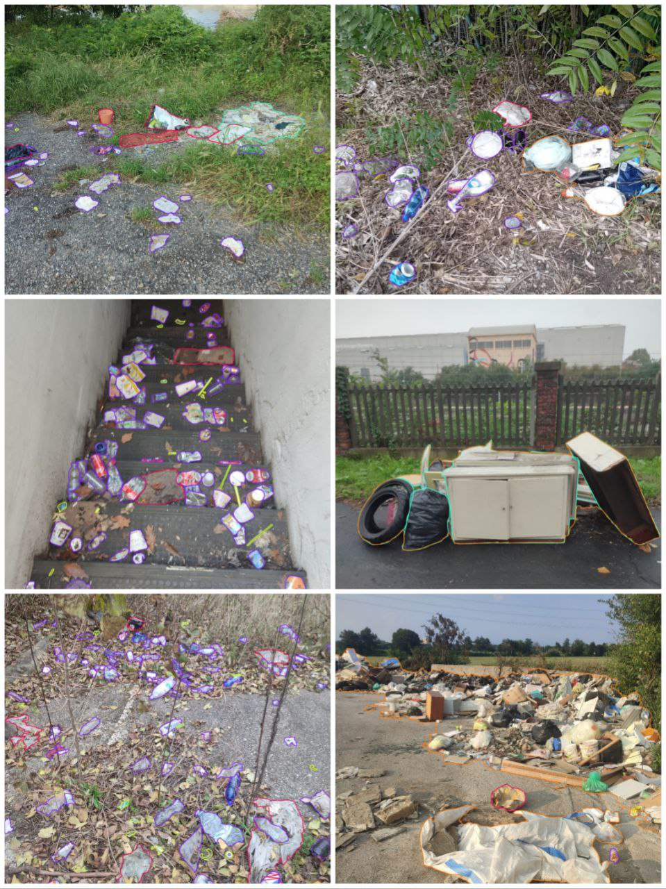
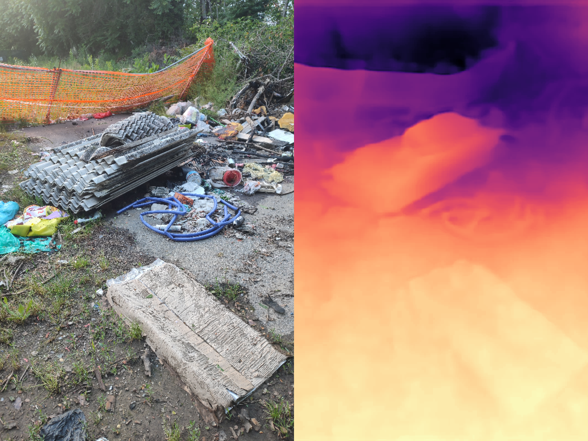
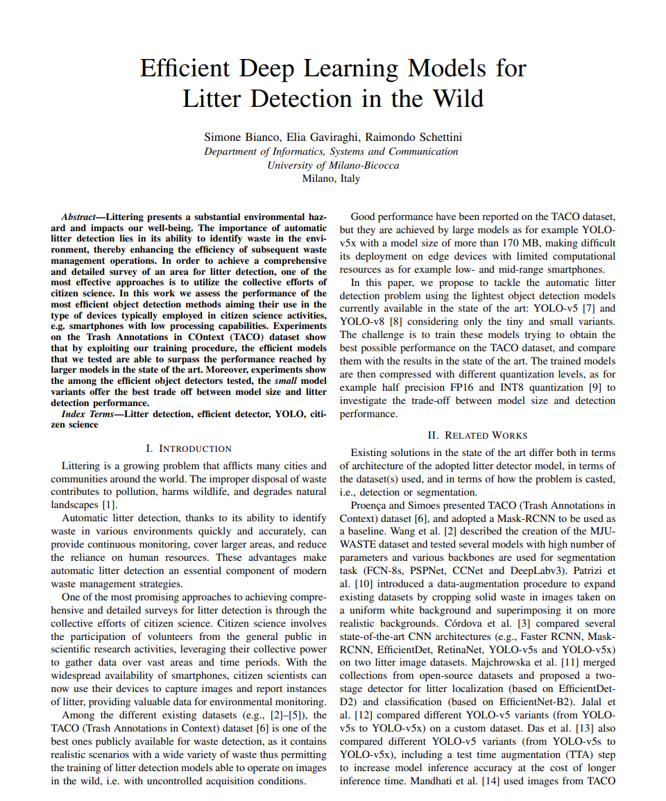
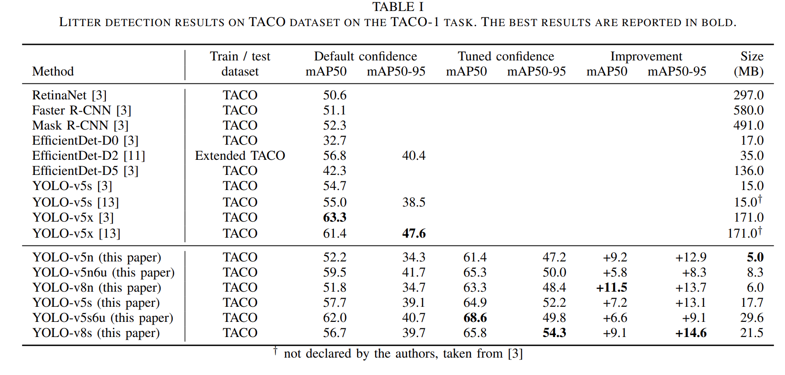
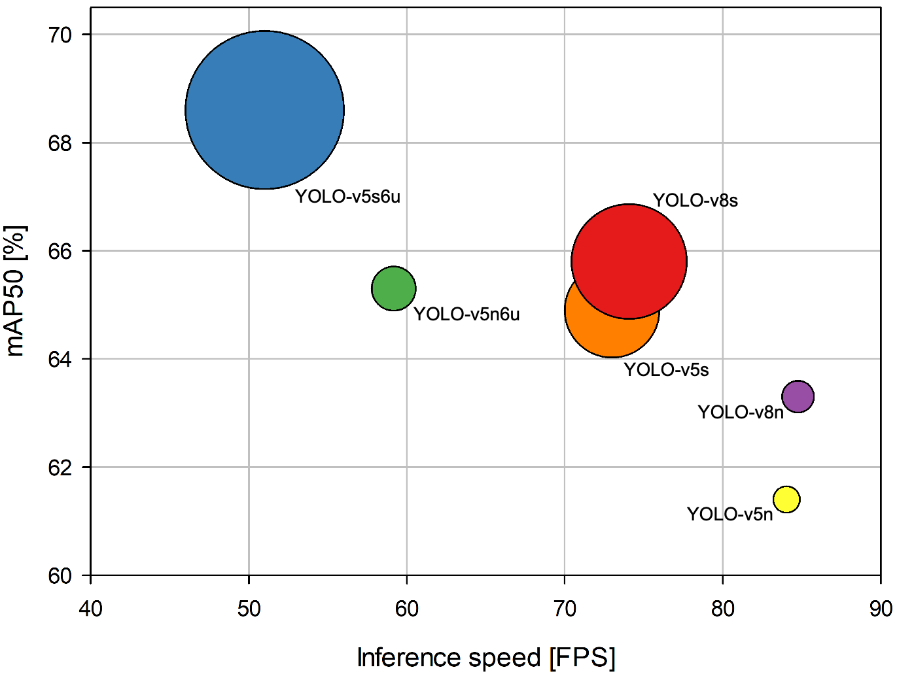

      

# COBOL-Litter-Detection 


## Overview

**COBOL (COmmunity-Based Organized Littering)** is a computer vision-based project for my master thesis, designed to detect litter in the wild using deep learning.

The goal of this project is to support environmental monitoring and urban cleanliness by automating the process of identifying various types of litter in images or videos.

## My thesis in a nutshell

- Explore SOTA datasets and approaches on litter detection
- **Collect the world's first public dataset of annotated litter in the wild images**, with polygonal and multiclass masks... for real! Divided by size (5 classes), not type (it's unfeasible, actually).
- Training YOLO v5/v8/ on TACO dataset, improving them by tuning a specific hyperparameter and publish a paper on this.
- Mixing datasets (TACO, PlastOPol and... **ours!**) to improve performance (stay soon)
- Develop two-stage YOLO World (unsupervised) pipeline to detect better license plate and faces *(to protect privacy people)*
- Implement a lot of tips to improve the previous.

## News 🚀 

### UniMiB Trash Dataset 🌱

The **first public multiclass dataset** for litter detection. Based on size instead of typology: stay soon.



### Depth YOLO 🔥

We are working on YOLO 4-Channel implementation: a CNN could see better with 3 colour channels + depth relative estimation with SOTA model?



### YOLO p2-p6 architecture on mixed dataset 🧠
We are trying to combine UniMiB, <a href="http://tacodataset.org/">TACO dataset</a> and <a href="https://research.wur.nl/en/datasets/plastopol-a-dataset-for-litter-detection">PlastOPol</a> to train from scratch a YOLO architecture similar to YOLO v5.6u, which used the p6 block in the backbone to identify large objects: we want to catch cigarettes too!

### YOLO hyperparameter tuning
We recorded increases of over 5% in terms of mAP50 on the same datasets as in the paper. 
p.s. *Try enabling the cosine scheduler. It may improve significantly*


## Paper

Our paper is out! You can find it on <a href="https://ieeexplore.ieee.org/document/10761805">**IEEE Xplore**</a>
We improved the performance of YOLO models on the <a href="http://tacodataset.org/">TACO dataset</a>, defining a **new state of the art**!




 


## Features
🚀 Tuning the confidence of your YOLO model! Check our paper above.
♻️ Introducing new dataset for multiclass litter detection: **UniMiB Trash dataset**.
🔍 Training CNN (YOLO) for Litter Detection with TACO and PlastOPol, SOTA dataset for this task.


## Repository Structure

```
COBOL-Litter-Detection/
┣ 📂 dataset/            # Contains labeled datasets
┣ 📂 models/             # Pre-trained or custom YOLOv8 models
┣ 📂 paper               # Our released paper!
┣ 📂 scripts/            # Python notebook template for train YOLO Model.
┣ 📂 utils/              # Utility functions and helpers
┣ 📂 images-videos/      # Don't care
┣ 📂 thesis              # pdf of full thesis and presentation
📄 README.md          # it's me!
```
